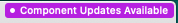
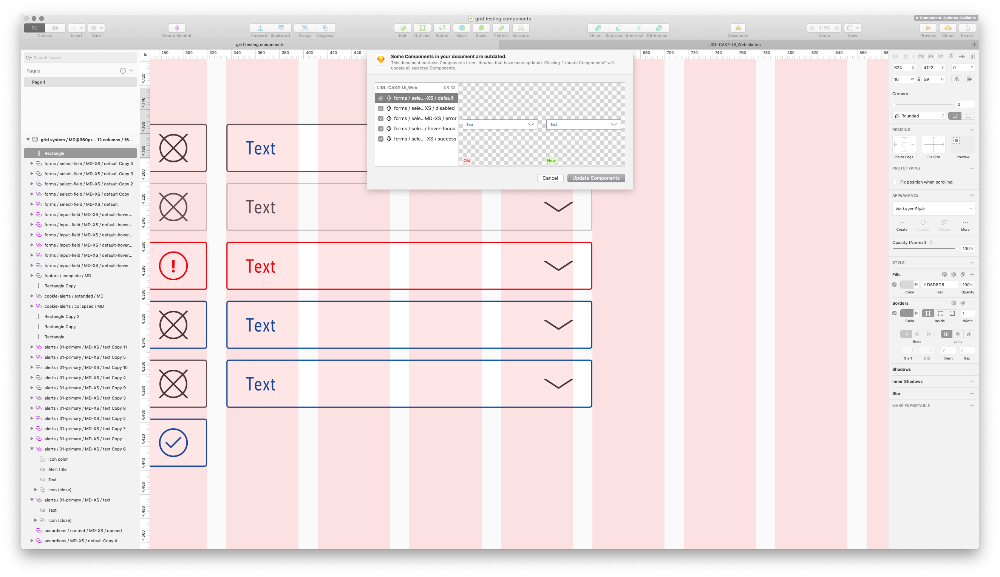
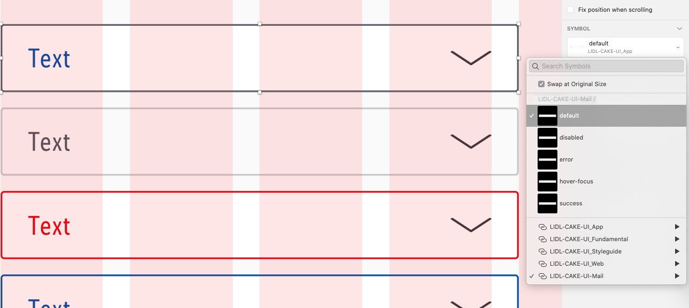
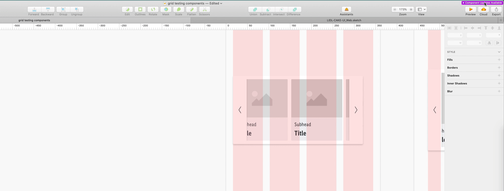
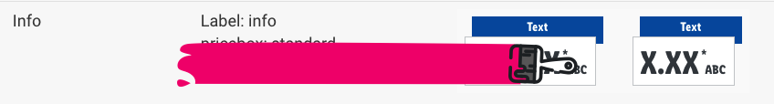
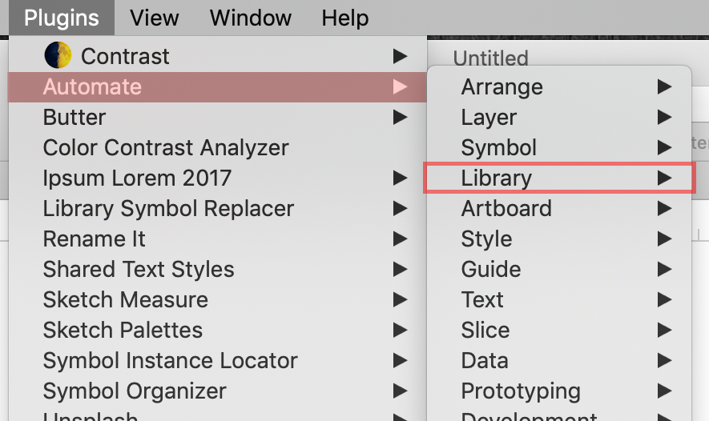
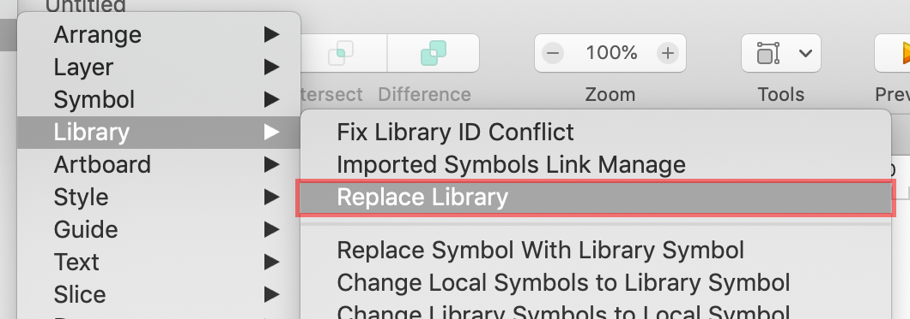

# Migration guide

## Update version 1.x to 2.x

### New Grid margins and XS breakpoint

The new grid settings now provide more design options. The current Breakpoint XS has been updated to the latest data sets. 
To continue working on existing designs with the new grid settings, we recommend following these steps in Sketch:

### Step 1: Update the grid settings
Ensure that the **latest library version** is connected. Easily proof it over **Preferences/Libraries** 
Proof the **artboard sizes** for your project. 
Select your artboard and edit on the custom toolbar **View/Layout settings** or navigate on the menu item **View/Canvas/Layout settings**. Enter the new documented values for the selected breakpoint and confirm.

### Step 2: Update components

Description | Preview
---------|----------
 With an existing design, Sketch displays a notification at the top right corner.  ༼ つ ◕_◕ ༽つ Click on it! |  
 The Sketch interface shows a list of all changed components. Check the listed components and confirm the updates. | 
 Select the component on your artboard and choose the same component from the **Symbol drop-down** list to get the new sizes. | 
 ٩(^‿^)۶ Tadaaaa!!  The component should now fits on the new grid settings. | 

 A short workflow should demonstrate how easily it is to update your placed components on your designs.

 

---

## Update version 6.x to 7.x (Fundamentals)

- We would like to keep our libraries and documentation up to date.
According to the official brand decision, the price box info is outdated. As a result, we are saying goodbye to this component in our Web, App and Mail libraries.

---

## Update version 4.x to 5.x (Fundamentals)

### New Git repositories

- All CAKE library files are now at home in the Git repositories of Azure DevOps.
- Visit [setup](../../Getting\ started/Setup/Setup.md) and find a step-by-step tutorial how to get all future CAKE updates again.

### Global file renaming

- The name of **LIDL CAKE UI Core** has been changed to **LIDL CAKE UI Fundamental** due to the new library setup of some Lidl Digital's CI elements.
- The new LIDL CAKE UI Fundamental library only consists of symbols, text- and layer-styles that are *fundamental* to each of our products.

### Symbol transfer

- Some symbols have been moved from our LIDL CAKE UI Fundamental library (earlier CORE) to their explicit product library files (e.g. LIDL CAKE UI Web, App,…).
- Verify that all the following symbols are linked to the correct Sketch library:
  - Buttons
  - Forms
  - Tables

### Replace library

- Due to the symbol transfer you need to replace the symbols: buttons, forms and tables in every of your Sketch files with the help of the plugin **Automate**.

| Steps | Description | Preview |
|---|---|---|
| 1 |  After downloading the plugin click on "Plugins/Automate/Library" | |
| 2 |  Choose "Replace library" from the given options | |
| 3 | Switch the settings under "Libraries of Imported Objects" to the new symbol location (e.g. LIDL-CAKE-UI_Web) and confirm your changes with "OK" | |

### Symbol replacement

- The simple cookie alert no longer exists in our LIDL CAKE UI Web library.
- Please verify that you don't use the simple cookie alert anymore!
- Therefore replace the simple version with our current cookie alert.
