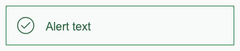
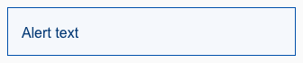
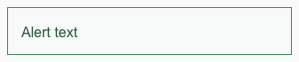
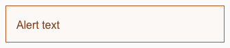
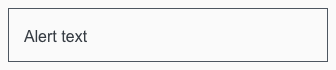
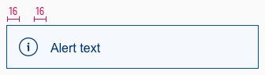
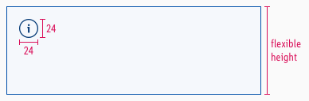

<AlertInfo alertHeadline="Modifiable">
Please ensure to comply with the corporate identity.
</AlertInfo>

# Alert

Different types of notifications with contextual feedback about user actions as well as permanent presentation of important information.

---

## General information

**Our "info" alert matches our brand-primary color**. Blue is the best color to demonstrate an "info" alert from UX point of view, in our case and in online studies. Part of the LIDL brand colors is "blue" and also the "brand-primary-color" on a digital device. It didn't make sense to create a new color "blue" for an "info" purpose. That's why the "brand-primary-color" for LIDL matches the "info" color. But if, for example, the "brand-primary-color" for LIDL will change, only the components using the "brand-primary-color" will change. This has the benefit that all info elements will stay "blue".

---

## Recommendations

- **Keep the alerts text as short as possible. Especially the title.**
- Use an alert, i.e for feedback, product recalls or support.

---

## Overall styling

- The text style is [large](../../General/Typography/Typography.md#large).
- The line-height is set to **default**.
- Every variant uses the **darker-color** as **text-** and **icon-color**
- The outline comes in **base-color**.
- The alert background always is the main-color's **background-color**.
- The border has a **thickness of 1px**.
- All widths are individually adjustable and fit into the layout columns and the 8-point-grid.
- The height depends on the content and the additional components shown.

### Title & icon

- Some alerts come with an additional fixed icon to emphasize their meaning.

| Version | Attributes | Preview |
|---|---|---|
| info | text- & icon-color: info-darker outline-color: info-base background-color: info-background fixed icon: information-circle.svg |  |
| danger | text- & icon-color: danger-darker outline-color: danger-base background-color: danger-background fixed icon: exclamation-triangle.svg |  |
| success | text- & icon-color: success-darker outline-color: success-base background-color: success-background fixed icon: hook-circle.svg |  |
| warning | text- & icon-color: warning-darker outline-color: warning-base background-color: warning-background fixed icon: exclamation-circle.svg |  |
| gray / neutral | text- & icon-color: gray-darker outline-color: gray-base background-color: gray-background icon: not fix (currently placeholder.svg) |  |

### Text

- Simple alerts to only display text.

| Version | Attributes | Preview |
|---|---|---|
| info | text-color: info-darker outline-color: info-base background-color: info-background |  |
| danger | text-color: danger-darker outline-color: danger-base background-color: danger-background |  |
| success | text-color: success-darker outline-color: success-base background-color: success-background |  |
| warning | text-color: warning-darker outline-color: warning-base background-color: warning-background |  |
| gray / neutral | text-color: gray-darker outline-color: gray-base background-color: gray-background |  |

---

## Spacing & Measurements

| Types | Attributes | Preview |
|---|---|---|
| Horizontal spacing | padding: 16px |  |
| Vertical spacing | padding: 16px |  |
| Icon size | 24x24px |  |

---

## What can be modified?

- Override the text and icons.
- Adjust the width and height according to the content.
- Modify alerts to your project needs by adding other symbols or styles (i.e. like dividers or links).

### Our workflow in Sketch

- Use the „Overrides“-function to select the required variant, to edit the content or to change the icon if necessary.
