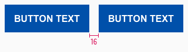

<AlertWarning alertHeadline="Not modifiable">
It is mandatory to maintain the appearance and behavior of these components.
</AlertWarning>

# Buttons

A button should lead the user to a certain action.

Unique labels give the user a clear message which action is exactly triggered.

---

## Overall styling

- The text-style is [button-text](../../General/Typography/Typography.md#button-text).
- The line-height is set to **default**.
- All buttons have a **fixed height of 48px**.
- Secondary buttons have an **outline** with **1px thickness**.

---

## Do's

- Keep the text short and use as few words as possible.
- Always use a specific call to action text.
- Choose a unique button labeling to send a clear message which action is exactly triggered by the button.
- Ensure consistent labelling across the user journey.
- Be sure to allow enough space for translation into other languages.
- Button with an icon may only be used in combination with an input field.

## Dont's

- Do not use more than two buttons below each other.
- Avoid exclamation marks.

---

## Types

- Each button level is available in a positive and a negative version.
- This allows you to layout on a light or dark background.

### Primary

- Our primary button is also our Call-to-Action (CTA) button.
- **It can only be used once per page!**

| Version | Preview |
|---|---|
| Positive |  |
| Negative |  |

### Secondary

- Use our secondary button if you want to show more than one button.
- **It can only be used in conjunction with the primary button!**

| Version | Preview |
|---|---|
| Positive |  |
| Negative |  |

---

## States

### Positive

#### Primary

| State | Overall styling | Preview |
|---|---|---|
| Default | background: brand-primary-base font-color: basic-white |  |
| Hover, focus and active | background: brand-primary-darker  font-color: basic-white |  |

#### Secondary

| Status | Overall styling | Preview |
|---|---|---|
| Default | outline-color: brand-primary-base   font-color: brand-primary-base |  |
| Hover, focus and active | background: brand-primary-base   font-color: basic-white|  |

### Negative

#### Primary

| Status | Overall styling | Preview |
|---|---|---|
| Default | background: basic-white   font-color: brand-primary-base |  |
| Hover, focus and active | background: gray-light   font-color: brand-primary-base |  |

#### Secondary

| Status | Overall styling | Preview |
|---|---|---|
| Default | outline-color: basic-white  font-color: basic-white |   |
| Hover, focus and active | background: gray-light   font-color: brand-primary-base |  |

---

## Spacing & Measurements

| Type | Attributes | Preview |
|---|---|---|
| Height | 48px | |
| Horizontal spacing | padding-left: 16px padding-right: 16px |  |
| Distance | 16px between two buttons |  |
