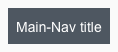
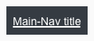
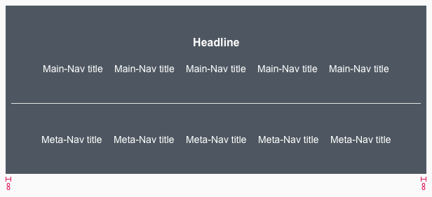
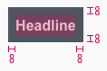
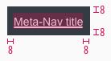

<AlertInfo alertHeadline="Modifiable">
Please ensure to comply with the corporate identity.
</AlertInfo>

# Footer

Use the footer to help the customer with additional information and navigation at the bottom of a website.

---

## Recommendations

- Keep the footer as short as possible. Do not load it with unnecessary information. The customer is interested in a first glance.
- Ideally, important links will be opened via a new window or a tab in the browser.

---

## Elements

The default footer contains the following elements:

- Headline
- Main-Navigation
- Meta-Navigation
- Divider
- Background

### Usage of elements

| Headline | Main-Navigation | Meta-Navigation |
|---|---|---|
|This element is not absolutely necessary for the setup of a footer, unless you want to title or organize your main-navigation categories.|Use it to show a summary of all possible links or menus on a LIDL website (i.e. sitemap, wishlist, shopping cart, account, ...). | For information, such as legal (imprint, terms and conditions, data protection, ...) or contact, which must be placed on a website.|

---

## Overall styling

- The headline is [large bold](../../General/Typography/Typography.md#large-bold) and the main-nav title/meta-nav title is [basic](../../General/Typography/Typography.md#basic).
- The line-height is set to **default**.
- The text-color always is **basic-white**.
- The background-color is always **gray-base**.
- The divider width depends on the breakpoint but has always a **height of 1px** and the **color gray-lighter**.
- There is no hover, active oder disabled status.

| Types | Attributes | Preview |
|---|---|---|
| Headline| text-style: [large bold](../../General/Typography/Typography.md#large-bold) ||
| Main-Navigation | text-style: [basic](../../General/Typography/Typography.md#basic) ||
| Meta-Navigation | text-style: [basic](../../General/Typography/Typography.md#basic) ||

---

## Status styling

| Types | Attributes | Preview |
|---|---|---|
| Main-Nav title | text-style: [basic](../../General/Typography/Typography.md#basic)  text is underlined  background-color: gray-darker ||
| Meta-Nav title | text-style: [basic](../../General/Typography/Typography.md#basic)  text is underlined  background-color: gray-darker ||

---

## Spacing & measurements

| Types | Attributes | Preview |
|---|---|---|
| Horizontal space | 8px |   |
| Vertical space | 32px|     |
| Padding | 8px|       |

---

## Our workflow in Sketch

- All variants are detachable and their arrangement can be changed.
- Combine the individual elements in Sketch to get the footer in various forms and for each breakpoint.
- Use the „Overrides“-function to edit the content of the symbols:
  - headline
  - main-navigation
  - meta-navigation
