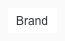
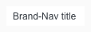
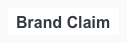
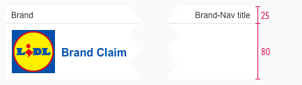
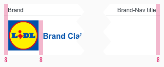

<AlertInfo alertHeadline="Modifiable">
Please ensure to comply with the corporate identity.
</AlertInfo>

# Header

The header is one of the essential components to create brand awareness.

The appearance symbolizes customers that they received a LIDL newsletter. Its strongest supporting element is the LIDL logo with the brand claim.

---

## Recommendations

- Keep the globally known LIDL Logo in the header.
- Only change the brand claim regarding to your country.

---

## Elements

1. Brand
2. Brand-navigation
3. Logo
4. Brand Claim
5. Divider

### Usage

- Use the **brand** to show a sub slogan or the release date of the newsletter.
- Use the **brand-navigation** as a link to supporting sites for the newsletter. For example to the newsletter profile of the customer or to a special page that presents LIDL (e.g. FAQ, responsibility, career …).
- Use the **brand-claim** to promote the newsletter slogan.
- Use the **logo** to show the user that this is a LIDL newsletter. You can also use the logo as a link to the shop.

---

## Overall styling

- The text style of brand and brand-navigation is [small](../../General/Typography/Typography.md#small).
- The text style of the brand claim is [page headline (Level 4)](../../General/Typography/Typography.md#page-headlines).
- The line-height is set to **default**.
- The divider has the **color gray-lighter** and a **height of 1px**. The length of the divider is the **full width** of the component.
- The header comes with a background-color in **basic-white**.

| Types | Attributes | Preview |
|---|---|---|
| Brand or   Brand-navigation | text-style: [small](../../General/Typography/Typography.md#small)   text-color: gray-darker |    |
| Brand Claim | text-style: [page headline (Level 4)](../../General/Typography/Typography.md#page-headlines)   text-color: brand-primary-base   position: vertically centered with logo |  |

---

## Spacing & Measurements

| Types | Attributes | Preview |
|---|---|---|
| Height | complete: 105px   brand: 25px   brand-claim: 80px |  |
| Width | SM: 600px   XS: 320px|     |
| Padding | padding-left and -right: 8px   padding logo and claim: 8px |  |
| Logo | size: 64x64px |  |

---

## Our workflow in Sketch

- Use the overrides to fill it with realistic content and scale the symbol to the right width.
