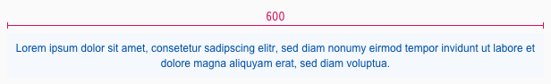
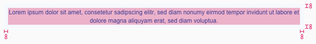
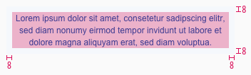

<AlertWarning alertHeadline="Not modifiable">
It is mandatory to maintain the appearance and behavior of these components.
</AlertWarning>

# Notification

The notification is used above the header. It informs the user about the browser view and contains a link that leads to the browser view.

---

## Overall styling

- The text style is [small](../../General/Typography/Typography.md#small).
- The line-height is set to **default**.
- The text alignment is set to center.
- The text-color is **brand-primary-base**
- Background-color is **brand-primary-background**.
- The height depends on the shown content.

### Example

---

## Measurements

| Type | Attributes | Preview |
|---|---|---|
| Width | SM: 600px   XS: 320px |     |
| Spacing | padding: 8px |     |
