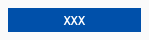
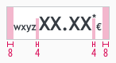
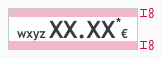
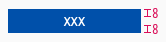
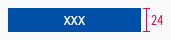
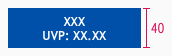
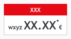
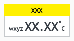
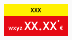
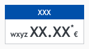

<AlertWarning alertHeadline="Not modifiable">
 It is mandatory to maintain the appearance and behavior of these components.
</AlertWarning>

# Pricebox

The use of the consistent Lidl pricebox is an elementary part of our brand awareness.

The pricebox contains several fix and optional elements and is available in different color combinations due to different visualizations (standard, offer, etc.).

---

## Elements

| Types | Attributes | Preview |
|---|---|---|
| Basic | 1. Prefix   2. Price   3. Asterik   4. Currency ||
| Basic quantity | 5. Basic quantity ||
| Offer | 6. Offer   7. Basic pricebox ||
| Discount | 8. Discount text   9. Recommended Retail Price (rrp) ||

---

## Overall styling

- The text-style is **price**.
- The text-style for the addons is **small-bold** for asterisk, currency & prefix.
- Additionally you can choose between a pricebox with or without prefix.

| Types | Attributes | Preview |
|---|---|---|
| Standard | text-color: gray-darker   background-color: basic-white   outline-color: gray-light |  |
| Offer | text-color: basic-white   background-color: danger-base |  |

---

## Label

- Combine the pricebox with a label to display promotions or discounts.
- You can advertise discounts, promotions or offers.
- Like the pricebox, you can choose between different label colors.
- The text-style always is **small bold**.
- Always use the **base-color** as background-color.

| Types | Attributes | Preview |
|---|---|---|
| Action | text-color: basic-white   background-color: danger-base |  |
| Info | text-color: basic-white   background-color: brand-primary-base |  |
| Offer | text-color: gray-darker   background-color: mark-base |  |

---

## Basic quantity

- It's used as additional info for the packaging unit, quantity or drained weight.
- The text-style always is **small**.
- The line-height is **120%**.

| Types | Attributes | Preview |
|---|---|---|
| Basic quantity | text-color: gray-darker |  |

---

## Discount

- If you want to use a discount, it can be placed in the pricebox **standard** (positive) as well as in the pricebox **offer** (negative) - with or without prefix.
- There is a positive and negative version matching the underlying standard pricebox.
- The text-style always is **small** for the discount text and the recommended retail pice (rrp).
- The strike comes either in **danger-base** or **gray-darker** with a **1px thickness**.

| Types | Attributes | Preview |
|---|---|---|
| Positive | text-color: gray-darker   strike-color: gray-darker |  |
| Negative | text-color: basic-white   strike-color: basic-white |  |

---

## Spacing & Measurements

- The height of the pricebox depends on the content and the additional components shown.
- The width of the pricebox depends on the content.
- The width of the label denpends width of the pricebox.
- The height of the label is fixed for one or two rows

### Pricebox

| Types | Attributes | Preview |
|---|---|---|
| Vertical spacing | 8px / 4px |  |
| Horizontal spacing | 8px |  |

### Label

| Types | Attributes | Preview |
|---|---|---|
| Padding | 8px  |  |
| Height | 1 row: 24px  2 rows: 40px |     |

---

## Position

### Basic quantity

- This information always is placed to the **right below the pricebox**.

| Types | Attributes | Preview |
|---|---|---|
| Basic quantity | text and pricebox align right   margin-top: 2px |  |

---

## Combinations

- There are **only four different combinations** of priceboxes and labels in the Lidl universe.
- They are called "themes".

| Types | Attributes | Preview |
|---|---|---|
| Offer #1 | label: action   pricebox: standard |  |
| Offer #2 | label: offer   pricebox: standard |  |
| Special offer | label: offer   pricebox: action |  |
| Info | Label: info   pricebox: standard |  |

---

## Our workflow in Sketch

- Use the "Overrides"-function to change the text.
- Enter the text first. Then adjust the width of the symbol.
- The color variants of the label can be selected in the complete pricebox via the "Overrides"-function.
