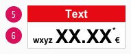
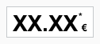
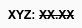
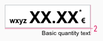

<AlertWarning alertHeadline="Not modifiable">
 It is mandatory to maintain the appearance and behavior of these components.
</AlertWarning>

# Pricebox

The use of the consistent LIDL pricebox is an elementary part of our brand awareness.

The pricebox contains several obligatory and optional elements and is available in different color combinations due to different visualizations (basic, offer, etc.).

---

## Recommendations

- If there is already a currency symbol in the pricebox no additional currency sign should be displayed in the recommended retail price or label.

---

## Elements

| Types | Attributes | Preview |
|---|---|---|
| Basic | 1. Prefix   2. Price   3. Asterisk   4. Currency ||
| Offer | 5. Offer   6. Basic pricebox ||
| Discount | 7. Discount text   8. Recommended Retail Price (rrp) ||

---

## Overall styling

- The text-style is [pricebox-price](../../General/Typography/Typography.md#pricebox-price) for the price.
- The text-style is [pricebox-addon](../../General/Typography/Typography.md#pricebox-addon) for asterisk, currency & prefix.
- The line-height is set to **default**.
- Additionally you can choose between a pricebox with or without prefix.

| Types | Attributes | Preview |
|---|---|---|
| Basic | text-color: basic-black   background-color: basic-white   outline-color: gray-light |  |
| Action | text-color: basic-white   background-color: danger-base |  |

---

## Label

- The text-style always is [pricebox-label](../../General/Typography/Typography.md#pricebox-label).
- The line-height is set to **default**.
- Always use the **base-color** as background-color.
- Combine the standard pricebox with a label to display promotions or discounts.
- Use the label as an add-on for the **offer** pricebox.
- You can advertise discounts, promotions or offers.
- Like the pricebox, you can choose between different label colors.

| Types | Attributes | Preview |
|---|---|---|
| Action | text-color: basic-white   background-color: danger-base | |
| Offer | text-color: basic-black   background-color: mark-base |  |

---

## Basic quantity

- The text-style is always [basic-quantity](../../General/Typography/Typography.md#pricebox-basic-quantity).
- The line-height is set to **default**.
- It's used as additional info for the packaging unit, quantity or drained weight.

| Types | Attributes | Preview |
|---|---|---|
| Basic quantity | text-color: basic-black |  |

---

## Discount

- The text-style always is [pricebox-addon](../../General/Typography/Typography.md#pricebox-addon) for the discount text and the recommended retail price (rrp).
- The line-height is set to **default**.
- If you want to use a discount, it can be placed in the pricebox **standard** (positive) as well as in the pricebox **offer** (negative) - with or without prefix.
- The strike comes either in **basic-black** or **basic-white**.
- There is a positive and negative version matching the underlying standard pricebox.

| Types | Attributes | Preview |
|---|---|---|
| Positive | text-color: basic-black   strike-color: basic-black |  |
| Negative | text-color: basic-white   strike-color: basic-white |  |

---

## Spacing & Measurements

- The height of the pricebox depends on the content and the additional components shown.
- The width of the pricebox depends on the content.
- The width of the label depends on the content of the pricebox.
- The height of the label is fixed for a single-line text.

### Pricebox

| Types | Attributes | Preview |
|---|---|---|
| Vertical spacing | SM: 6px/5px   XS: 4px / 3px |   |
| Horizontal spacing | SM: 8px / 4px   XS: 4px / 4px |   |

### Label

| Types | Attributes | Preview |
|---|---|---|
| Vertical spacing | SM: 4px   XS: 4px |   |
| Horizontal spacing | SM: 8px   XS: 4px |   |
| Height | SM: 24px   XS: 22px |   |

---

### Discount

| Types | Attributes | Preview |
|---|---|---|
| Discount | SM: 6px / 2px  XS: 3px / 1px |   |

## Position

### Basic quantity

- This information always is placed to the **right below the pricebox**.

| Types | Attributes | Preview |
|---|---|---|
| Basic quantity | text and pricebox align right   margin-top: 2px |  |

---

## Combinations

- There are **only three different combinations** of priceboxes and labels in the LIDL universe.

| Types | Attributes | Preview |
|---|---|---|
| Offer #1 | label: action   pricebox: basic |  |
| Offer #2 | label: offer   pricebox: basic |  |
| Special offer | label: offer   pricebox: action |  |

---

## Our workflow in Sketch

- Use the "Overrides"-function to change the text.
- Enter the text first. Then adjust the width of the symbol.
- The color variants of the label can be selected in the complete pricebox via the "Overrides"-function.
