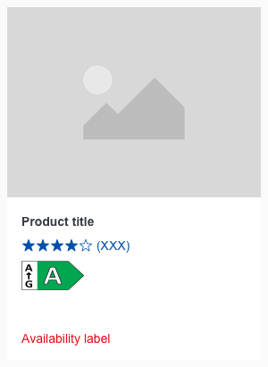
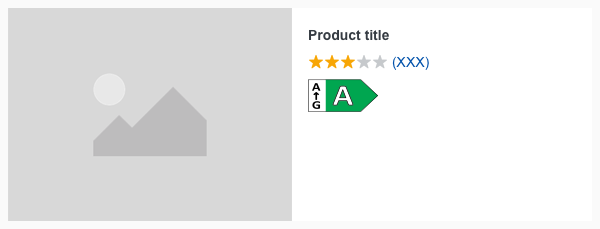
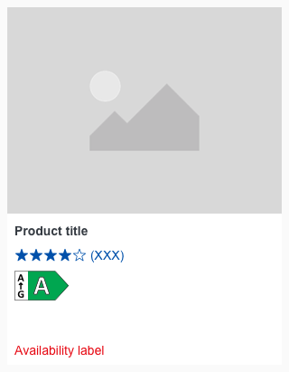
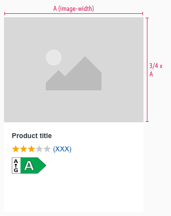
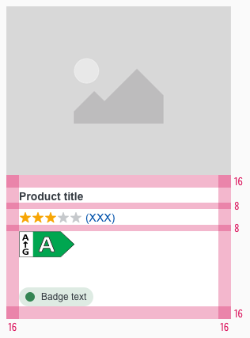
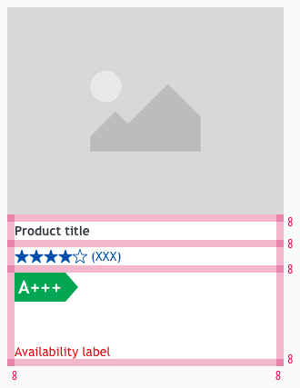

<AlertInfo alertHeadline="Modifiable">
Please ensure to comply with the corporate identity.
</AlertInfo>

# Product Tile

Each product is presented with the product tile.

The product tile is a basic component which can be combined with other components (e.g.: price-fields, ribbons, availabilities, etc).

---

## Recommendations

- Ideally, the product title should be single-line or a maximum of two lines.
- Please use as less text as possible in the product description.

---

## Overall styling

- The text style of the product title is [basic bold](../../General/Typography/Typography.md#basic-bold).
- The text style of the product description is [small](../../General/Typography/Typography.md#small).
- The label text style is [label text](../../General/Typography/Typography.md#label-text).
- The rating text in brackets is [basic](../../General/Typography/Typography.md#basic).
- The line-height is set to **default**.
- The image ratio always is **4:3**.
- The height of the white area depends on the content and the additional components shown.
- All widths are fixed and aligned to the layout grid of the breakpoints.
- The width of the component is divisible by 8 and equal to the image-width.
- The product tile has no hover, active or disabled status.
- You can choose between two tile formats in the SM breakpoint for your newsletter needs.

| Types | Attributes | Preview |
|---|---|---|
| Default | Product title text-color: gray-darker   Label text-color: danger-base  Rating text-color: brand-primary-base  background-color: basic-white |  |

---

## Formats

| Breakpoints | Attributes | Preview |
|---|---|---|
| SM | Portrait or landscape  |      |
| XS | Only portrait |  |

---

## Spacing & measurements

| Types | Attributes | Preview |
|---|---|---|
| Image size | Always ratio 4:3 |  |
| Padding | Overall   SM: 16px   XS: 8px     Title to description   SM: 8px   XS: 8px |  |

---

## Our workflow in Sketch

- To change the text or image use the "Overrides"-function.
- Place additional elements like the pricebox element on top of the product tile.
- To demonstrate a multi-line product title, the symbol must be detached from the library.
