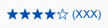
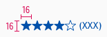
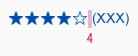
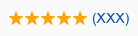
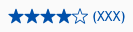
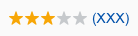
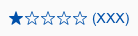

<AlertInfo alertHeadline="Modifiable">
Please ensure to comply with the corporate identity.
</AlertInfo>

# Rating

The product rating is visually represented with a star rating.

---

## Recommendations

- The maximum number of 5 stars can be reached.
- If the product has not yet been rated, no stars will appear in the product tile.
- The number in the bracket indicates how many users have already submitted a rating.

---

## Overall styling

- The text style is [basic](../../General/Typography/Typography.md#basic).
- The line-height is set to **default**.
- The icon **star-filled** or **star-outline** is used.
- The color is **brand-primary-base**.

---

## Spacing & measurements

- The height of the rating is **16px**.
- The width depends on the number of given ratings in the bracket.

| Types | Attributes | Preview |
|---|---|---|
| Icon-size | 16px |  |
| Padding | 4px|  |

---

## Variants

| Rating |  Preview |
|---|---|
| 5 stars ||
| 4 stars ||
| 3 stars ||
| 2 stars ||
| 1 stars ||
| No stars | Not yet rated no stars are shown. |

---

## Position

- The rating appears in the product tile between the image and the product title.

---

## Our workflow in Sketch

- Use the "Overrides"-function to change the number of stars.
