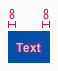

<AlertInfo alertHeadline="Modifiable">
Please ensure to comply with the corporate identity.
</AlertInfo>

# Ribbons

Use ribbons to add unique selling prepositions or other information.

Basically it is positioned in a context with a product tile, teaser, or image.

---

## Overall styling

- The text-style is **small bold**.
- The line-height is **120%**.

---

## Recommendations

- If you decide to use a ribbon, never use more than a **maximum of 2 variations**  *(our "info" ribbon matches our brand-primary color due to the purpose of the color "blue")*.

---

## Variants

- The ribbon has 3 colored variations: **highlight**, **gray** and **info**.

| Variants | Attributes | Preview |
|---|---|---|
| highlight | text-color: basic-white background-color: danger-base |  |
| gray | text-color: basic-white background-color: gray-base |  |
| info | text-color: basic-white background-color: info-base |  |

---

## Spacing & measurements

| Types | Attributes | Preview |
|---|---|---|
| Horizontal spacing | padding-left/-right: 8px text-alignment: centered |  |

---

## Position

- The ribbon is placed below the **image**.
- Several ribbons have **no distance** to each other at the bottom.

---

## Our workflow in Sketch

Use the "Overrides"-function to place the ribbon into the content area of the product tile and to change the text of the ribbon.
