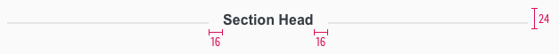
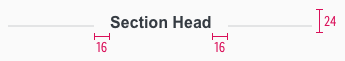

<AlertInfo alertHeadline="Modifiable">
Please ensure to comply with the corporate identity.
</AlertInfo>

# Section head

Use section headlines to structure the page content. This allows you to structure sections or separate them more clearly from each other. Only a two-line text is allowed as a maximum variant.

---

## Recommendation

- **Avoid too long or multiline text.**

---

## Overall styling

- Text-style is always [section head](../../General/Typography/Typography.md#section-head).
- The line-height is set to **default**.
- Font-color is **gray-darker**.
- The lines/dividers color is **gray-lighter** and has a **2px thickness**.
- The width of the left and right line depends on the text length and are scaled completely identically over all stylings.

## Spacing & measurements

| Types | Attributes | Preview |
|---|---|---|
| SM-XS | height: 24px   padding-left /-right: 16px   text-width: 60% |   |

---

## Our workflow in Sketch

Unfortunately, the symbol must be detached first to add demo content to a sectionhead. Simply adjust the lines/dividers to the distance defined for the text box.
