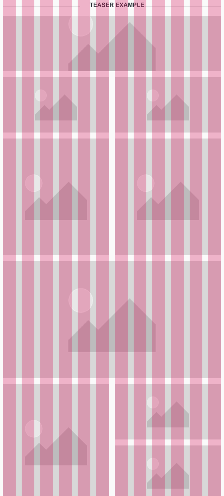

<AlertInfo alertHeadline="Modifiable">
Please ensure to comply with the corporate identity.
</AlertInfo>

# Teaser

Use the teaser component to attract attention and build excitement and expectations through curiosity.

---

## Recommendations

- The teaser is a placeholder element that is placed in the appropriate size.
- The teaser and it’s look are determined by content.
- The font of the teaser is maintained in the image.
- The teaser arrangement can be freely adjusted and combined.
- Try to keep the 4:3 ratio for teasers to guarantee the right display in each breakpoint.
- Otherwise it’s ratio is completely free adjustable.

---

## Overall styling

- The image has a **free ratio**.
- The image should be **divisible by 8**.
- The teasers are provided in **3 heights** for every breakpoint **148px, 200px, 312px**.
- Only in tablet view the teasers are povided in **full width and half width**.

---

## Spacing & Measurements

- In the tablet view (SM) it is possible to place the teasers in four or two columns.
- In the smartphone view (XS) place only one teaser over two column to guarantee a readable view for the user.

### Tablet view

| Types | Attributes | Preview |
|---|---|---|
| Small | 584 x 148px ||
| Medium | 584 x 200px||
| Large | 584 x 312px ||

| Types | Attributes | Preview |
|---|---|---|
| Small | 284 x 148px ||
| Medium | 284 x 200px ||
| Large | 284 x 312px ||

### Smartphone view

| Types | Attributes | Preview |
|---|---|---|
| Small | 304 x 148 px ||
| Medium | 304 x 200 px ||
| Large | 304 x 312 px ||

---

## Example

- Following example shows how the different teasers can be arrange in tablet view (SM).

---

## Teaser Topic

Type | Gray | White
---------|----------|---------
Default |  | 

## Spacing & Measurements

Types | Attributes | Preview
---------|----------|---------
 Horizontal | padding: 8px |  
 Vertical | padding: 8px   distance: 2px | 
Image ratio | default size of 4:3 |

---

## Our workflow in Sketch

- Use the "Overrides"-function to change placeholder with the teaser image.
- To change the width of the teaser manually adjust the width of the teaser.
