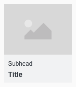
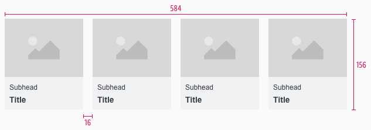
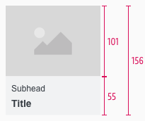
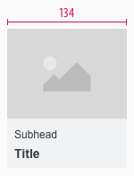
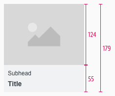
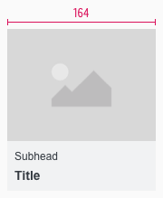

<AlertInfo alertHeadline="Modifiable">
Please ensure to comply with the corporate identity.
</AlertInfo>

# Theme Slider

The theme slider is a navigation bar for special offers and topics that should be displayed prominently to the user with pictures.

All offers are listed horizontally next to each other. Sliding of offers is a characteristic feature of this components.

---

## Overall styling

- The title has the text-style of **basic-bold**.
- The subheadline comes in the text-style **small**.
- The line-height is **120%**.
- Height and width of the component is **divisible by 8**.
- The image ratio is always **4:3**.
- There is **no hover or active state**.

### Item

- An item is a single navigation element in the theme-slider that is shown with an image and text.

| Types | Attributes | Preview |
|---|---|---|
| Default | font-color: gray-darker   background-color: gray-lightest |  |

---

## Spacing & Measurements

- The total height and width of the component is based on the size of the individual elements and their corresponding spacings.
- The width also depends on how many elements are displayed and is always a multiple of 8.
- The padding and gutter **always is 8px**.

| Breakpoints | Attributes | Preview |
|---|---|---|
| SM | height: 160px   width: 584px |  |
| XS | height: 342px   width: 304px |   |

### Desktop (SM)

| Type | Attributes | Preview |
|---|---|---|
| Height | image: 105px   text: 55px complete: 160px |  |
| Width | 140px |  |
| Spacing | padding: 8px   margin: 2px |  |

### Smartphone (XS)

| Type | Attributes | Preview |
|---|---|---|
| Height | image: 112px text: 55px complete: 167px |  |
| Width | 148px |  |
| Spacing | padding: 8px   margin: 2px |  |

---

## Our workflow in Sketch

- Use the "Overrides"-function to customize the theme slider in the two possible variants or to change the titles or sub-headlines.
- To delete a not needed tile use the "Overrides"-function. Delete always from back to front to avoid gaps in the component.
