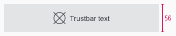
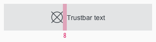
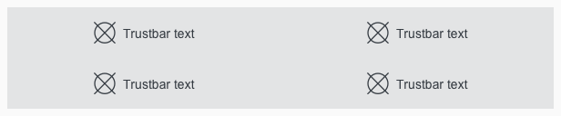

<AlertInfo alertHeadline="Modifiable">
Please ensure to comply with the corporate identity.
</AlertInfo>

# Trustbar

The trustbar is a possibility to show unique selling propositions, services or other outstanding benefits of the company. The standard position on a website is right above the footer.

---

## Recommendations

- Use only one word or a short single line of text.
- There is no multiline.
- Please ensure that the content meets this requirement.

---

## Overall styling

- The text-style is [basic](../../General/Typography/Typography.md#basic).
- The line-height is set to **default**.
- Default states icon- and text-color is **gray-darker**.
- The background-color always is **gray-lighter**.
- The hover, focus and active state is also shown in gray-darker but the **mouse cursor changes into a link cursor (pointer)**.
- The icon and text are **aligned horizontally and vertically to the center**.

---

## Spacing & measurements

| Types | Attributes | Preview |
|---|---|---|
| Height | SM & XS: 56px |  |
| Width | 4 or 12 colums|  |
| Icon-size | 24x24px |  |
| Horizontal spacing | margin: 8px |  |

---

## Variants

- The width depends on the number of elements but always matches our grid.
- The width of the single trustbar elements adapts to grid.
- The trustbar extends over the entire screen width.
- The minimum version consists of 3 and the maximum version of 4 trustbar elements.

| Breakpoints | 3-items | 4-items |
|---|---|---|
| SM |||
| XS |||

---

## Our workflow in Sketch

- Change the text or icon by using the "Overrides"-function.
- To delete a not needed tile use the "Overrides"-function. Always delete from bottom to top to avoid gaps in the component.
