<AlertWarning alertHeadline="Not modifiable">
It is mandatory to maintain the appearance and behavior of these components.
</AlertWarning>

# Links

A link is a reference for the user that can lead directly to an external or internal destination by clicking or tapping on it.

---

## Overall styling

- The text style depends on the body text and is either [small](../../General/Typography/Typography.md#small), [small bold](../../General/Typography/Typography.md#small-bold), [basic](../../General/Typography/Typography.md#basic), [basic bold](../../General/Typography/Typography.md#basic-bold), [large](../../General/Typography/Typography.md#large) or [large bold](../../General/Typography/Typography.md#large-bold).
- The appearance of the state depends on the usage or context.
- There’s also a positive and negative version to layout on a light or dark background.
- The icon can only be placed **before**, **not after** the link.
- Icons are always displayed like in the font color.

---

## Positive version

- Use the positive version if you want to display a link on a light background.
- Always make sure you have enough contrast when choosing the background.

| State | Attributes | Preview |
|---|---|---|
| Default / visited | text-color: brand-primary-base text-decoration: underline | 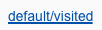 |

---

## Negative version

- Use the negative version if you want to display a link on a dark background.
- Always make sure you have enough contrast when choosing the background.

| State | Attributes | Preview |
|---|---|---|
| Default / visited | text-color: basic-white text-decoration: underline | 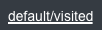 |

---

## Text styles

| Text style | Font size | Preview |
|---|---|---|
| Small | 12px | 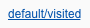 |
| Small bold | 12px | 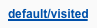 |
| Basic | 14px |  |
| Basic bold | 14px | 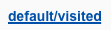 |
| Large | 16px | 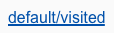 |
| Large bold | 16px | 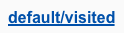 |

---

## Spacing & measurements

| Type | Attributes | Preview |
|---|---|---|
| Vertical spacing | 8px between icon and label | 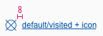 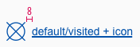 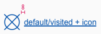 |
| Icon size | small: 16x16px basic: 24x24px large: 32x32px | 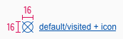 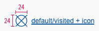 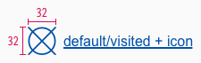  |

---

### Our workflow in Sketch

- Take one of the text styles for the different font sizes to display a linked text.
- Then the text style is  manually adjusted to the status.
- Detach the text style if you want to show a link in a copy-text.
