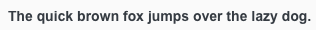
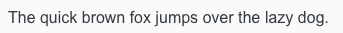
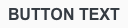
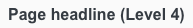

<AlertWarning alertHeadline="Not modifiable">
It is mandatory to maintain the appearance and behavior of these components.
</AlertWarning>

# Typography

Arial is a system font that can be used without any risk of failure.

---

## Typefaces

- All types of headings should primarily be used in **single line scenarios**.
- Use any base color of **brand-primary**, **danger**, **success**, **info** or **warning** as text color as long as it has a high contrast ratio in interaction with backgrounds.

## Arial

"Arial is an extremely versatile family of typefaces which can be used with equal success for text setting in reports, presentations, magazines etc, and for display use in newspapers, advertising and promotions." 
*Quote: [Microsoft Typography Font Arial](https://docs.microsoft.com/en-us/typography/font-list/arial)*

| | |
---------|----------|
| **Regular** |   |
| **Bold** |   |
| **Designers** | Monotype Type Drawing Office - Robin Nicholas, Patricia Saunders 1982

---

## Small

- The typeface is always **regular**.
- The line-height always is **140%**.
- It is mainly used, i. e. for labels, highlights.

| Text style | Font size | Preview |
|---|---|---|
| Small | 12px |  |

## Small bold

- The typeface is always **bold**.
- The line-height always is **140%**.
- It is mainly used, i. e. for labels, highlights.

| Text style | Font size | Preview |
|---|---|---|
| Small bold | 12px |  |

---

## Basic

- The typeface is always **regular**.
- The line-height always is **140%**.
- It is mainly used, i. e. for body text, tables, lists, etc.

| Text style | Font size | Preview |
|---|---|---|
| Basic | 14px |  |

## Basic bold

- The typeface is always **bold**.
- The line-height always is **140%**.
- It is mainly used, i. e. to highlight single words, paragraphs.

| Text style | Font size | Preview |
|---|---|---|
| Basic bold | 14px |  |

---

## Large

- The typeface is always **regular**.
- The line-height always is **140%**.
- It is mainly used, i. e. for headlines, highlights.

| Text style | Font size | Preview |
|---|---|---|
| Large | 16px |  |

## Large bold

- The typeface is always **regular**.
- The line-height always is **140%**.
- It is mainly used, i. e. for headlines, highlights.

| Text style | Font size | Preview |
|---|---|---|
| Large bold | 16px |  |

---

## Button text

- The typeface is always **bold**.
- The line-height is **120%**.
- The text style is only used in our button component.

| Text style | Font size | Preview |
|---|---|---|
| Button text |16px |  |

---

## Label text

- The typeface is always **regular**.
- The line-height is **120%**.
- The text style is only used in our label component.

| Text style | Font size | Preview |
|---|---|---|
| Label text | 14px |  |

---

## Page headlines

- The typeface is always **bold**.
- The line-height always is **120%**.
- The page headlines are displayed in 5 levels.
- All levels have different font sizes.
- There are fixed font sizes from level 5 to level 1.

| Text style | Font size | Preview |
|---|---|---|
| Page headline (Level 1) | 28px |  |
| Page headline (Level 2) | 24px |  |
| Page headline (Level 3) | 20px |  |
| Page headline (Level 4) | 16px |  |
| Page headline (Level 5) | 14px |  |

---

## Section head

- The typeface is always **bold**.
- The line-height always is **120%**.
- Section head has only one size and font.
- The text of a section headline is always centered on the screen.
- It is always bold and uppercase.

| Text style | Font size | Preview |
|---|---|---|
| Section head | 16px |  |

---

## Pricebox

- The typeface is always **bold**.
- The line-height is **100%**.

### Addon

- These font sizes are only used for additional text of our pricebox, i.e. prefix, currency, recommended retail price (rrp).

| Breakpoint | Font size | Preview |
|---|---|---|
| SM-XS | 12px |  |

### Basic quantity

- These font sizes are only used for the basic quantity text of our pricebox.
- The line-height is **120%**.

| Breakpoint | Font size | Preview |
|---|---|---|
| SM-XS | 10px |  |

### Price

| Breakpoint | Font size | Preview |
|---|---|---|
| SM | 28px |  |
| XS | 20px |  |

### Label

| Breakpoint | Font size | Preview |
|---|---|---|
| SM | 16px |  |
| XS | 14px |  |

---

## Lists

- Lists are used for text structuring.

Type | Attributes | Preview |
---------|----------|----------|
 Bullets | Bulletpoints are special text characters whose form depends on the system.  Size and color depend on the font style of the copy text. |  |
  Numbered | Numbers are text characters of the font. Size and color depend on the font style of the copy text. |  |

---

## Spacing & measurements

Type | Attributes | Preview |
---------|----------|----------|
| Vertical spacing | 32px between **headline (Level 1)** and other headlines or body text.  16px between **headline (Level 2)** and other headlines or body text.  8px between **headline (Level 3)** and other headlines or body text.  32px between body text and body text or headlines.  8px between **headline (Level 4)** and other headlines or body text.  8px between **headline (Level 5)** and other headlines or body text. |  |
| Vertical spacing | 16px between **section headline (Level 1)** and body text.  32px between body text and body text or headlines. |  |
---

## Our workflow in Sketch

- All text styles are included in our CAKE UI Mail library.
- Use only these styles!
