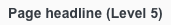

<AlertWarning alertHeadline="Not modifiable">
It is mandatory to maintain the appearance and behavior of these components.
</AlertWarning>

# Typography

Trebuchet MS is a system font that can be used without any risk of failure. It was chosen for it's similar look to the Lidl Font.

---

## Typefaces

- All types of headings should primarily be used in **single line scenarios**.
- Use any base color of **brand-primary**, **danger**, **success**, **info** or **warning** as text color as long as it has a high contrast ratio in interaction with backgrounds.

 
 

---

## Regular

- The line-height always is 140%.
- It is mainly used, i. e. for body text, links, tables, lists, etc.

| Text style | Font size | Preview |
|---|---|---|
| Small | 12px |  |
| Basic | 16px |  |
| Large | 20px |  |

---

## Bold

- The line-height always is 140%.
- It is mainly used, i. e. for headlines, labels, highlights.

| Text style | Font size | Preview |
|---|---|---|
| Small bold | 12px |  |
| Basic bold | 16px |  |
| Large bold | 20px |  |

---

## Button text

- The text style is only used in our button component.
- The line-height is 120%.

| Text style | Font size | Preview |
|---|---|---|
| Button text |16px |  |

---

## Label Text

- The text style is only used in our label component.
- The line-height is 120%.

| Text style | Font size | Preview |
|---|---|---|
| Label text | 14px |  |

---

## Page headlines

- The page headlines are displayed in 5 levels.
- All levels have different font sizes.
- There are fixed font sizes from level 5 to level 1.
- The line-height always is 120%.

| Text style | Font size | Preview |
|---|---|---|
| Page headline (Level 1) | 28px |  |
| Page headline (Level 2) | 24px |  |
| Page headline (Level 3) | 20px |  |
| Page headline (Level 4) | 16px |  |
| Page headline (Level 5) | 14px |  |

---

## Section headlines

- Section headline has only one size and font.
- It matches level 4 of the page headline, but is written in capital letters.
- The text of a section headline is always centered on the screen.
- It is always bold and uppercase.
- The line-height always is 120%.

| Text style | Font size | Preview |
|---|---|---|
| Section headline | 20px |  |

---

## Our workflow in Sketch

- All text styles are included in our CAKE UI Mail library.
- With Sketch v51.2 text styles can always be linked to this document.
- Use only these styles!
