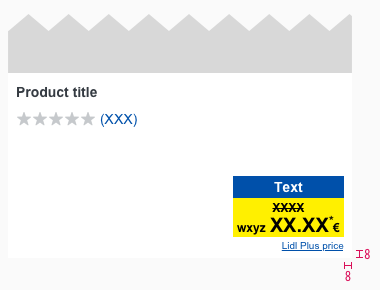

<AlertWarning alertHeadline="Not modifiable">
 This component is deprecated and will not supported anymore. The new version is so far only in <a href="/Lidl/Web/Design/Lidl_Plus/Pricebox/Pricebox.md"> Web</a> available.
</AlertWarning>

# Pricebox

Use this component **only to promote a special LIDL Plus price** to the customer.

> Usage of the LIDL Plus price **must be coordinated with and permitted by the legal department of your LIDL country**.

---

## Elements

| Attributes | Preview |
|---|---|
| 1. LIDL Plus pricebox   2. LIDL Plus label   3. Recommended retail price (rrp)   4. Legal info ("Lidl Plus price")   5. Basic quantity ||

---

## Overall styling

### Pricebox

- The text-style is [pricebox-price](../../General/Typography/Typography.md#pricebox-price) for the price.
- The text-style is [pricebox-addon](../../General/Typography/Typography.md#pricebox-addon) for asterisk, currency & prefix.
- The text-color is **basic-black**.
- The background-color is **mark-base**.
- The line-height is set to **default**.
- For each breakpoint, you can select a corresponding symbol to suit your layout.
- Additionally you can choose between a pricebox: **basic**, **no-prefix** or **with-prefix**.

| Types | Attributes | Preview |
|---|---|---|
| Basic | No prefix   No currency | |
| No prefix | No prefix   With currency | |
| With prefix | With prefix   With currency ||

### Label

- The text-style is always [pricebox-label](../../General/Typography/Typography.md#pricebox-label).
- The line-height is set to **default**.
- The label is a required addon for the complete **LIDL Plus price**.

| Attributes | Preview |
|---|---|
| text-color: basic-white   background-color: info-base |  |

### Legal info

- The text-style is [pricebox-basic-quantity](../../General/Typography/Typography.md#pricebox-basic-quantity).
- This element follows the styling of our [positive link version](../../General/Link/Link.md#positive-version).
- Tapping on this info guides the user directly to the legal info implemented at the bottom of a newsletter via jump mark.

> The legal info is a required addon for the complete **LIDL Plus price** and has a fix notation of "Lidl Plus price".

| Attributes | Preview |
|---|---|
| text-color: info-base |  |

### Basic quantity

- The text-style is always [pricebox-basic-quantity](../../General/Typography/Typography.md#pricebox-basic-quantity).
- The line-height is set to **default**.
- It's used as additional info for the packaging unit, quantity or drained weight.

| Attributes | Preview |
|---|---|
| text-color: basic-black |  |

### Discount

- The text-style is always [pricebox-addon](../../General/Typography/Typography.md#pricebox-addon) for the recommended retail price (rrp).
- The line-height is set to **default**.
- The positive discount is a required addon for the complete **LIDL Plus price**.

| Attributes | Preview |
|---|---|
| text- & strike-color: basic-black |  |

---

## Spacing & measurements

- The width of the pricebox depends on the content.
- The width of the label depends on the content of the pricebox.
- The height of the label is fixed for a single-line text.

### Pricebox

| Types | Attributes | Preview |
|---|---|---|
| Vertical spacing | SM: 6px / 5px   XS: 4px / 3px |   |
| Horizontal spacing | SM: 8px / 4px   XS: 4px / 4px |   |

### Label

- The width of the label depends on the content of the pricebox.
- The height of the label is fixed for a single-line text.

| Types | Attributes | Preview |
|---|---|---|
| Vertical spacing | SM: 4px   XS: 4px |   |
| Horizontal spacing | SM: 8px   XS: 4px |   |
| Height | SM: 24px   XS: 22px |   |

### Discount

| Types | Attributes | Preview |
|---|---|---|
| Discount | SM: 6px / 2px  XS: 3px / 1px |   |

### Legal info & basic quantity

| Types | Attributes | Preview |
|---|---|---|
| Legal info | text and pricebox align right   margin-top: 2px |  |
| Basic quantity | text and pricebox align right   margin-top: 0px |  |

---

## Position & combinations

> Use it only in combination with a **product tile, teaser or image**.

- The pricebox is placed in the **lower right corner**.
- The distance of the price to the borders of the product tile is **8px** each.

*This is a non-obligatory example.*
